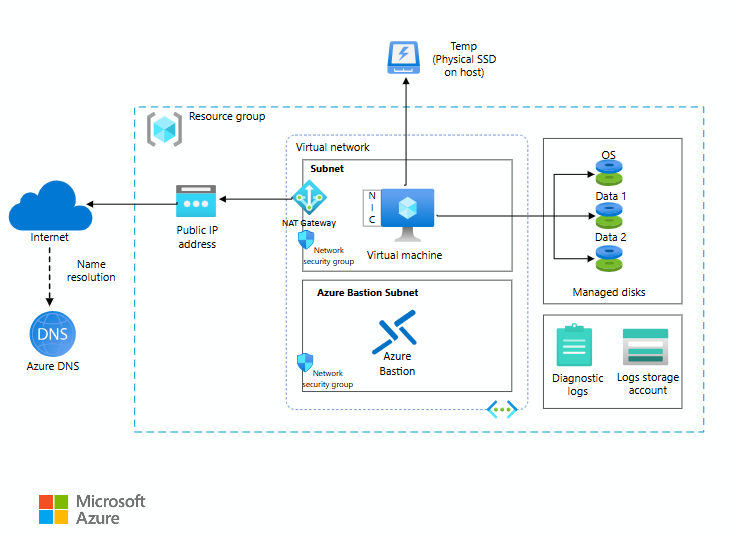
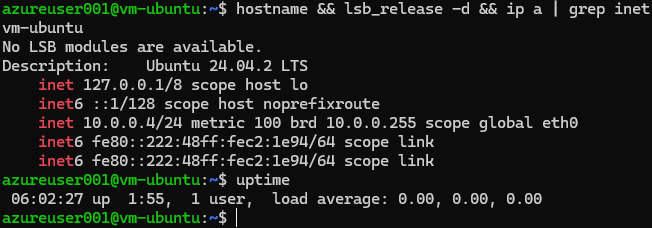

  

---

<h1 align="center"> VM Ubuntu Linux em Cloud </h1>

Este projeto tem como objetivo a criação e configuração de uma máquina virtual com Ubuntu 24.04 LTS na plataforma Microsoft Azure. A proposta é fornecer um ambiente de desenvolvimento Linux acessível remotamente via SSH com usuário e senha, sem uso de chave SSH.

A VM foi criada como um ambiente de aprendizado prático, ideal para testes e estudo de administração de servidores Linux. A configuração inclui instalação de ferramentas básicas, servidor web Apache, e ativação de firewall com regras de acesso.

A máquina foi provisionada utilizando uma conta do Azure for Students, com endereço IP público para permitir o acesso remoto. O sistema operacional utilizado é o Ubuntu 24.04 LTS, uma distribuição amplamente usada em servidores e ambientes de nuvem.

Abaixo está o diagrama ilustrando a configuração básica da VM criada no Azure.

  

---

## ☁️ Funcionalidades 
- Criação e configuração de uma máquina virtual com Ubuntu 24.04 LTS na plataforma Microsoft Azure.
- Acesso remoto via SSH utilizando usuário e senha (sem uso de chave SSH).
- Configuração de rede padrão, com endereço IP público atribuído para acesso remoto.
- Instalação e configuração de um servidor web Apache para testes de conectividade.
- Ativação e configuração do firewall (UFW) com liberação da porta do Apache.
- Ambiente pronto para desenvolvimento, testes ou aprendizado em Linux.

---

## ☁️ Testes de Software
- Teste de Conexão SSH:

Conexão à VM utilizando SSH com usuário e senha. | Resultado: Conexão estabelecida com sucesso, acesso ao terminal da máquina.

- Teste de Atualização de Sistema:

Atualização dos pacotes do sistema usando sudo apt update && sudo apt upgrade -y. | Resultado: Sistema atualizado com sucesso.

- Teste de Instalação de Aplicações:

Instalação do servidor web Apache e ferramentas básicas (git, curl, wget, htop, etc.). | Resultado: Instalações concluídas e serviços funcionando.

- Teste de Firewall (UFW):

Configuração e ativação do firewall permitindo o tráfego para o Apache. | Resultado: Firewall ativo e regras funcionando corretamente.

- Imagem do Teste:

---
 
## ☁️ Tecnologias 

---

## ☁️ Pré-requisitos e Instalações
1. Conta no **Azure**.
2. **Git Bash** ou **PowerShell** instalado no computador local.

---

## ☁️ Instruções de Uso
1. **Acesse o portal do Azure** 
2. Salve o acesso geradao durante a criação da VM.
3. Conectar via PowerShell (ou terminal com suporte a SSH)
4. Conecte-se à VM com o comando:
**Execute o seguinte comando no PowerShell:**
 
   > ssh azureuser001@172.179.240.9

   > password: Y787812##YAEY
5. Após a conexão, você estará dentro da VM e poderá executar comandos Linux.
6. Agora o que você precisa fazer:
Copie e cole estes comandos aqui, diretamente nessa tela (nessa conexão SSH):

-  Atualizar os pacotes
 > sudo apt update && sudo apt upgrade -y

-  Instalar ferramentas básicas
 > sudo apt install -y git curl wget unzip htop net-tools ufw

-  Instalar servidor web Apache
 > sudo apt install -y apache2

-  Ativar o Apache para iniciar sempre
 > sudo systemctl enable apache2

-  Iniciar o Apache agora
 > sudo systemctl start apache2

-  Liberar Apache no firewall
 > sudo ufw allow 'Apache Full'

-  Ativar o firewall
 > sudo ufw enable
7.  Teste final:
- Comando de verificação no terminal.
- Para comprovar a execução da VM e do sistema operacional, execute
 > hostname && lsb_release -d && ip a | grep inet
- Esse comando exibirá o nome da máquina, versão do Ubuntu e os IPs ativos.**

## ✅ Resultado Final✅
- A VM foi criada, configurada, atualizada, equipada com servidor web Apache, ferramentas essenciais, e está acessível via SSH com usuário e senha. O ambiente está pronto para desenvolvimento, testes ou aprendizado.

